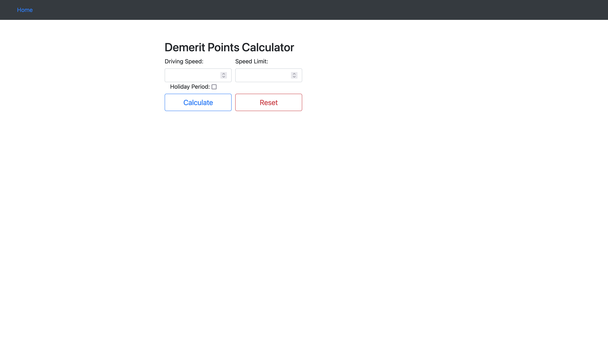

# Demerit Points Calculator

## Description

This is a web application that calculates the demerit points for a speeding ticket. The user enters the speed limit, the speed at which the driver was driving, and if it is a public holiday. The application then calculates the demerit points and displays it to the user. This was made for a lab project in DE101, Introduction to Programming, Ara Institute of Canterbury.

## Technologies

- HTML5 - Creating the web page
- Bootstrap - Styling the web page
- Python - Calculating the demerit points
- Flask - Running the web application
- PythonAnywhere - Hosting the web application

## Usage

The program can be accessed [here](https://fas0265.pythonanywhere.com/).
To run the program locally,

1. Clone the repository
2. Ensure that you have Python 3 and Flask installed

```bash
pip install flask
```

3. Navigate to the project directory and run the following command

```bash
python flask_app.py
```

Please be aware that the program is in no way an accurate representation of the demerit points system in New Zealand. It is only a lab project for a programming course.

## Screenshot

